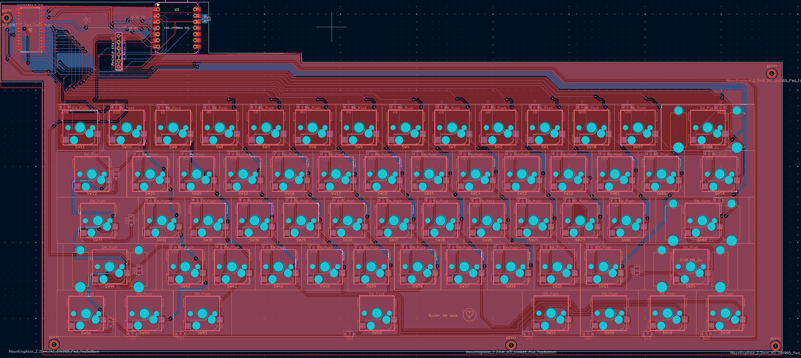
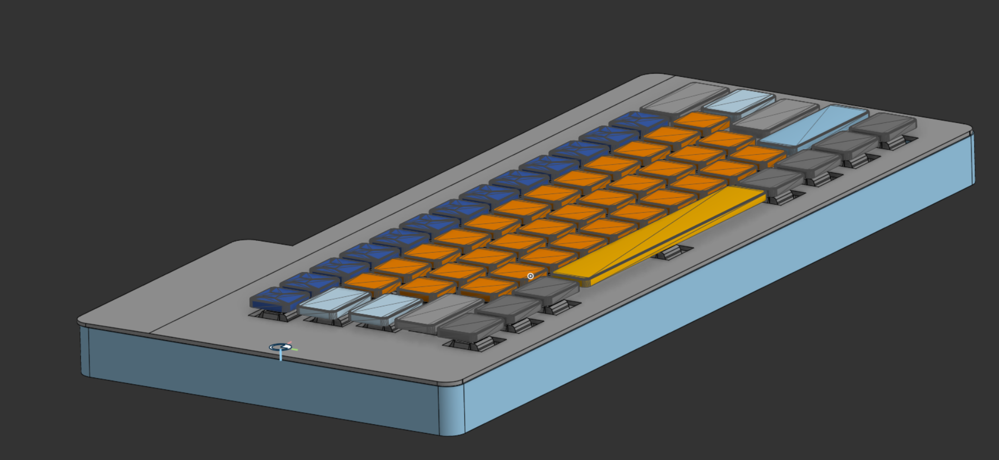
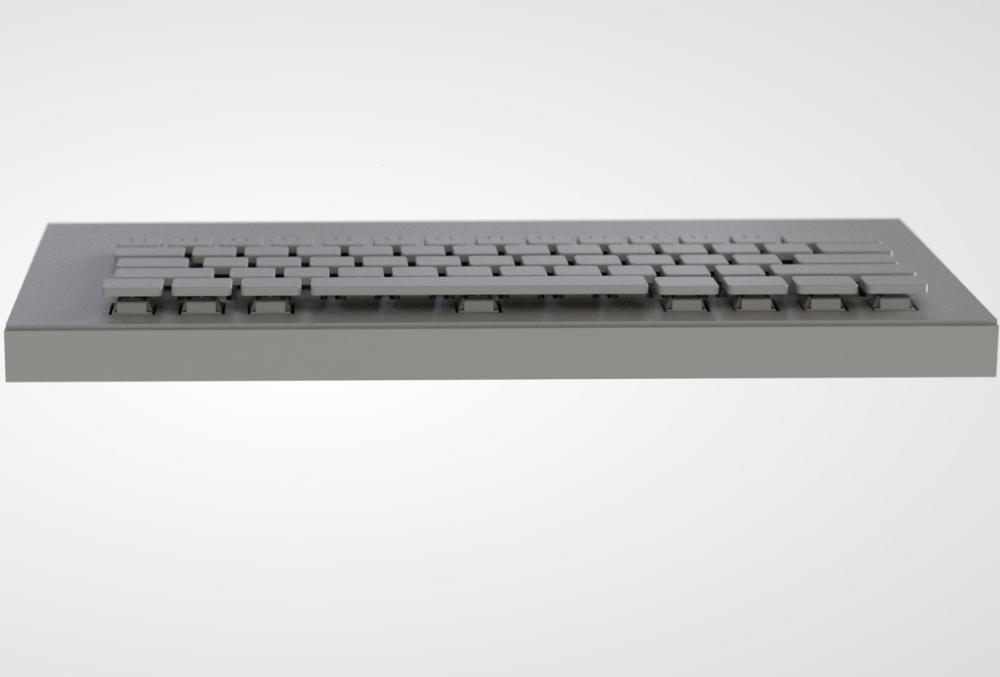

# Mecahnical Keyboard
I made this projects because I wanted to learn how software and hardware come together inside something as simple keyboard (Which I found wasn't simple at all). I wanted to also learn how to make a PCB and how to CAD with better practices. This is a Mechanical keyboard that utilizes both a main chip and a "slave" chip (a chip made to work as if it were just an i/o extender). This uses a diode-matrix for the sensing and uses the SDA and SCL channels on the "slave" chip to read and understand. 

BOM (Used an program for this to convert to a table in a .md file)
| Item                                          |  Description                                                  |  Quantity                                                                      |  Unit Price |  Total Price |  shipping                                                                                                                                            |  Link                                                                                                                                                                                                                                                                                                                                                                                                                                                                                                                                                                                                                                                                                                                                                                                                                                                                                                                                                                                   |  Running Total |
| --------------------------------------------- | ------------------------------------------------------------- | ------------------------------------------------------------------------------ | ----------- | ------------ | ---------------------------------------------------------------------------------------------------------------------------------------------------- | --------------------------------------------------------------------------------------------------------------------------------------------------------------------------------------------------------------------------------------------------------------------------------------------------------------------------------------------------------------------------------------------------------------------------------------------------------------------------------------------------------------------------------------------------------------------------------------------------------------------------------------------------------------------------------------------------------------------------------------------------------------------------------------------------------------------------------------------------------------------------------------------------------------------------------------------------------------------------------------- | -------------- |
| Kailh Hotswap Switches (70 PCS)               |  Need for the mechanical Keyboard switches                    |  1                                                                             |  $4.90      |  $4.90       |                                                                                                                                                      |  https://www.aliexpress.us/item/3256807290300019.html?spm=a2g0o.cart.0.0.655c38dakew0gR&mp=1&pdp_npi=5%40dis%21USD%21USD%2010.00%21USD%205.00%21%21USD%205.00%21%21%21%402103212b17669562373644915e8654%2112000040910888023%21ct%21US%216957464215%21%211%210&_gl=1*7n8lx*_gcl_aw*R0NMLjE3NjY5NTY1MjkuQ2owS0NRaUF4OFBLQmhEMUFSSXNBS3NtR2JmVFB0Uld6WHhSZGZYQmY2YmJCM0ppSWhiVndEci14TE1SelRfRDM4Y1R5UERmcTU4enRMc2FBaENJRUFMd193Y0I.*_gcl_dc*R0NMLjE3NjY5NTY1MjkuQ2owS0NRaUF4OFBLQmhEMUFSSXNBS3NtR2JmVFB0Uld6WHhSZGZYQmY2YmJCM0ppSWhiVndEci14TE1SelRfRDM4Y1R5UERmcTU4enRMc2FBaENJRUFMd193Y0I.*_gcl_au*MTg0MTgyOTEyNy4xNzY1OTI2NjE1*_ga*MTA1MDk4OTI5NS4xNzY2OTU0OTQ3*_ga_VED1YSGNC7*czE3NjY5NTQ5NDckbzEkZzEkdDE3NjY5NTY3ODgkajYwJGwwJGgw&gatewayAdapt=glo2usa                                                                                                                                                                                                                              |  $4.90         |
| Capacitor: 10 nano farad                      |  Need for voltage regulation in the MCP23017                  |  2                                                                             |  $0.00      |  $0.00       |                                                                                                                                                      |  Part is from JLCPCB and is accounted for later in the "PCB & PCB A" section                                                                                                                                                                                                                                                                                                                                                                                                                                                                                                                                                                                                                                                                                                                                                                                                                                                                                                            |                |
| Capacitor: 10 micro farad                     |  Need for voltage regulation in the XIAO-nRF52840             |  2                                                                             |  $0.00      |  $0.01       |                                                                                                                                                      |  Part is from JLCPCB and is accounted for later in the "PCB & PCB A" section                                                                                                                                                                                                                                                                                                                                                                                                                                                                                                                                                                                                                                                                                                                                                                                                                                                                                                            |                |
| Diode                                         |  Needed for switch detection                                  |  122                                                                           |  $0.01      |  $1.10       |                                                                                                                                                      |  Part is from JLCPCB and is accounted for later in the "PCB & PCB A" section                                                                                                                                                                                                                                                                                                                                                                                                                                                                                                                                                                                                                                                                                                                                                                                                                                                                                                            |                |
| Resistors                                     |  Needed for the SCL and SDA lines in between the MCP and XIAO |  4 (But forced to by 20 since that is the lowest amount of tape sold by JLCPCB |  $0.00      |  $0.04       |                                                                                                                                                      |  Part is from JLCPCB and is accounted for later in the "PCB & PCB A" section                                                                                                                                                                                                                                                                                                                                                                                                                                                                                                                                                                                                                                                                                                                                                                                                                                                                                                            |                |
| M2-0.4x6mm Fine Thread Philips Screw (50 PCS) |  Need for Mounting the PCB inside the case                    |  1                                                                             |  $1.21      |  $1.21       |                                                                                                                                                      |  https://www.aliexpress.us/item/3256808318392916.html?spm=a2g0o.productlist.main.1.4227904aPLsG2r&algo_pvid=8adeba12-a6d4-497b-a664-d3c65681da6a&algo_exp_id=8adeba12-a6d4-497b-a664-d3c65681da6a-0&pdp_ext_f=%7B%22order%22%3A%221548%22%2C%22eval%22%3A%221%22%2C%22fromPage%22%3A%22search%22%7D&pdp_npi=6%40dis%21USD%211.22%210.99%21%21%211.22%210.99%21%402101f54117669565417065484e30aa%2112000045477825050%21sea%21US%216957464215%21ABX%211%210%21n_tag%3A-29910%3Bd%3A9013ec3d%3Bm03_new_user%3A-29895%3BpisId%3A5000000187461913&curPageLogUid=1B8gFB9tpgbc&utparam-url=scene%3Asearch%7Cquery_from%3A%7Cx_object_id%3A1005008504707668%7C_p_origin_prod%3A&_gl=1*svni5x*_gcl_aw*R0NMLjE3NjY5NTQ5NjAuQ2owS0NRaUF4OFBLQmhEMUFSSXNBS3NtR2JkbV9Wd1pDZUd1b0tJd0wyMzRhZ3BfWjdUb1V5MlZTeFBDbHkyYVUyby1vVXphWG84Uk1oc2FBdnY3RUFMd193Y0I.*_gcl_au*MTg0MTgyOTEyNy4xNzY1OTI2NjE1*_ga*MTA1MDk4OTI5NS4xNzY2OTU0OTQ3*_ga_VED1YSGNC7*czE3NjY5NTQ5NDckbzEkZzEkdDE3NjY5NTY1NDQkajYwJGwwJGgw |  $6.11         |
| MCP23017-E/SO                                 |  I/O expander that I need in order to make the full keyboard  |  1                                                                             |  $0.99      |  $0.99       |                                                                                                                                                      |  https://www.aliexpress.us/item/3256810374801839.html?spm=a2g0o.productlist.main.2.77f5IXMhIXMhAF&algo_pvid=e8501886-1288-485f-a514-a1c879ddfb29&algo_exp_id=e8501886-1288-485f-a514-a1c879ddfb29-1&pdp_ext_f=%7B%22order%22%3A%22-1%22%2C%22eval%22%3A%221%22%2C%22fromPage%22%3A%22search%22%7D&pdp_npi=6%40dis%21USD%2113.11%210.99%21%21%2191.32%216.91%21%402101f11417669549847548423eec63%2112000052856422464%21sea%21US%210%21ABX%211%210%21n_tag%3A-29910%3Bd%3A1e4e634d%3Bm03_new_user%3A-29895%3BpisId%3A5000000187461913&curPageLogUid=8ompgAlH495t&utparam-url=scene%3Asearch%7Cquery_from%3A%7Cx_object_id%3A1005010561116591%7C_p_origin_prod%3A                                                                                                                                                                                                                                                                                                                          |  $7.10         |
| XIAO-nRF52840                                 |  Main Chip of this keyboard                                   |  1                                                                             |  $13.01     |  $13.01      |                                                                                                                                                      |  https://www.aliexpress.us/item/3256808117851584.html?spm=a2g0o.productlist.main.7.3ee7aNioaNioHj&algo_pvid=a97ae570-3fd6-4518-abb6-32d770b1e93e&algo_exp_id=a97ae570-3fd6-4518-abb6-32d770b1e93e-6&pdp_ext_f=%7B%22order%22%3A%22111%22%2C%22eval%22%3A%221%22%2C%22fromPage%22%3A%22search%22%7D&pdp_npi=6%40dis%21USD%2110.10%2110.10%21%21%2170.31%2170.31%21%402101df0e17669551094443275eda12%2112000044555521520%21sea%21US%210%21ABX%211%210%21n_tag%3A-29910%3Bd%3A1e4e634d%3Bm03_new_user%3A-29895&curPageLogUid=50eSLpqHWYKf&utparam-url=scene%3Asearch%7Cquery_from%3A%7Cx_object_id%3A1005008304166336%7C_p_origin_prod%3A                                                                                                                                                                                                                                                                                                                                                  |  $20.11        |
| PCB & PCBA                                    |  The total price for both making the PCB and the PCBA         |  1                                                                             |  $36.62     |  $36.62      |  $63.64
 (FedEx Express (DDP) I can't do anything about the price  there is also a 10 dollar discount as such the grand total comes to be $114.35) |  JLCPCB (CAN'T PROVIDE A LINK)                                                                                                                                                                                                                                                                                                                                                                                                                                                                                                                                                                                                                                                                                                                                                                                                                                                                                                                                                          |  $134.46       |
| Key Switch                                    |  Needed for typing                                            |  1                                                                             |  $11.20     |  $11.20      |                                                                                                                                                      |  https://www.aliexpress.us/item/3256806499127042.html?spm=a2g0o.cart.0.0.119e38daoqse3D&mp=1&pdp_npi=5%40dis%21USD%21USD%2011.21%21USD%2011.21%21%21USD%2011.21%21%21%21%402101e80f17669585322435838ec12b%2112000038218653076%21ct%21US%216957464215%21%211%210&_gl=1*gffty9*_gcl_aw*R0NMLjE3NjY5NTgyNDguQ2owS0NRaUF4OFBLQmhEMUFSSXNBS3NtR2JmQUFHcUtNY3B5MU8xZEpYcC1KQmpCRi1yMkM3VEswRUFtMGNUUmZReU1lM1lSSjliV3RzY2FBakQ5RUFMd193Y0I.*_gcl_dc*R0NMLjE3NjY5NTgyNDguQ2owS0NRaUF4OFBLQmhEMUFSSXNBS3NtR2JmQUFHcUtNY3B5MU8xZEpYcC1KQmpCRi1yMkM3VEswRUFtMGNUUmZReU1lM1lSSjliV3RzY2FBakQ5RUFMd193Y0I.*_gcl_au*MTg0MTgyOTEyNy4xNzY1OTI2NjE1*_ga*MTA1MDk4OTI5NS4xNzY2OTU0OTQ3*_ga_VED1YSGNC7*czE3NjY5NTQ5NDckbzEkZzEkdDE3NjY5NTg1MzIkajUwJGwwJGgw&gatewayAdapt=glo2usa                                                                                                                                                                                                                           |  $145.66       |
| Key Caps                                      |  Needed to put on the swtiches                                |  1                                                                             |  $10.83     |  $10.83      |                                                                                                                                                      |  https://www.aliexpress.us/item/3256804183268436.html?src=google&pdp_npi=4%40dis%21USD%2110.83%2110.83%21%21%21%21%21%40%2112000028934642287%21ppc%21%21%21&src=google&albch=shopping&acnt=179-224-6891&isdl=y&slnk=&plac=&mtctp=&albbt=Google_7_shopping&aff_platform=google&aff_short_key=_oFgTQeV&gclsrc=aw.ds&albagn=888888&ds_e_adid=&ds_e_matchtype=&ds_e_device=c&ds_e_network=x&ds_e_product_group_id=&ds_e_product_id=en3256804183268436&ds_e_product_merchant_id=563759696&ds_e_product_country=US&ds_e_product_language=en&ds_e_product_channel=online&ds_e_product_store_id=&ds_url_v=2&albcp=23114515373&albag=&isSmbAutoCall=false&needSmbHouyi=false&gad_source=1&gad_campaignid=23118775333&gbraid=0AAAABBR8xIeRvhWb_9Ku5wF_pep51_OBj&gclid=Cj0KCQiAx8PKBhD1ARIsAKsmGbfAAGqKMcpy1O1dJXp-JBjBF-r2C7TK0EAm0cTRfQyMe3YRJ9bWtscaAjD9EALw_wcB&gatewayAdapt=glo2usa                                                                                                           |  $156.49       |
| Resistor Network                              |  Pull up Resistor chain                                       |  2                                                                             |  $1.77      |  $1.77       |                                                                                                                                                      |  https://www.aliexpress.us/item/3256806684196291.html?spm=a2g0o.cart.0.0.655c38dakew0gR&mp=1&pdp_npi=5%40dis%21USD%21USD%202.70%21USD%201.78%21%21USD%201.78%21%21%21%402103212b17669562373644915e8654%2112000038573406947%21ct%21US%216957464215%21%211%210&_gl=1*1fbksrg*_gcl_aw*R0NMLjE3NjY5NTQ5NjAuQ2owS0NRaUF4OFBLQmhEMUFSSXNBS3NtR2JkbV9Wd1pDZUd1b0tJd0wyMzRhZ3BfWjdUb1V5MlZTeFBDbHkyYVUyby1vVXphWG84Uk1oc2FBdnY3RUFMd193Y0I.*_gcl_au*MTg0MTgyOTEyNy4xNzY1OTI2NjE1*_ga*MjI2OTg1MDkxLjE3NjY5NTU3NDY.*_ga_VED1YSGNC7*czE3NjY5NTU3NDUkbzEkZzEkdDE3NjY5NTY0NTUkajYwJGwwJGgw&gatewayAdapt=glo2usa                                                                                                                                                                                                                                                                                                                                                                                      |  $158.26       |
| Soldering Wire (Lead Free)                    |  Needed For Soldering                                         |  1                                                                             |  $3.47      |  $3.47       |                                                                                                                                                      |  https://www.aliexpress.us/item/3256810239367550.html?spm=a2g0o.productlist.main.3.6fae31a3JUGwVE&algo_pvid=2b9bc4d0-e253-4360-b2cb-9148e3e8c081&algo_exp_id=2b9bc4d0-e253-4360-b2cb-9148e3e8c081-2&pdp_ext_f=%7B%22order%22%3A%227%22%2C%22eval%22%3A%221%22%2C%22fromPage%22%3A%22search%22%7D&pdp_npi=6%40dis%21USD%217.54%210.99%21%21%2152.50%216.88%21%402101c44517669559046362254ed6dc%2112000052371160761%21sea%21US%216957464215%21ABX%211%210%21n_tag%3A-29910%3Bd%3A1e4e634d%3Bm03_new_user%3A-29895%3BpisId%3A5000000187461913&curPageLogUid=hSphYWSM5PaN&utparam-url=scene%3Asearch%7Cquery_from%3A%7Cx_object_id%3A1005010425682302%7C_p_origin_prod%3A                                                                                                                                                                                                                                                                                                                   |  $161.73       |
| Stabalizers                                   |  Needed for the larger keys                                   |  1                                                                             |  $6.77      |  $6.77       |  $11.85                                                                                                                                              |  https://www.aliexpress.us/item/2251832533420646.html?spm=a2g0o.productlist.main.3.2c756ad92TU7VN&algo_pvid=b65fade0-7f1d-4251-948a-926cfa9af3fb&algo_exp_id=b65fade0-7f1d-4251-948a-926cfa9af3fb-2&pdp_ext_f=%7B%22order%22%3A%2217%22%2C%22eval%22%3A%221%22%2C%22fromPage%22%3A%22search%22%7D&pdp_npi=6%40dis%21USD%216.77%210.99%21%21%216.77%210.99%21%402101e2b617669566038303233e2e16%2165420166339%21sea%21US%216957464215%21ABX%211%210%21n_tag%3A-29910%3Bd%3A1e4e634d%3Bm03_new_user%3A-29895%3BpisId%3A5000000187461913&curPageLogUid=hNoizrgNcue8&utparam-url=scene%3Asearch%7Cquery_from%3A%7Cx_object_id%3A32719735398%7C_p_origin_prod%3A                                                                                                                                                                                                                                                                                                                              |  $180.35       |
# PCB Image

#CAD Image

# 3D Render '0'

